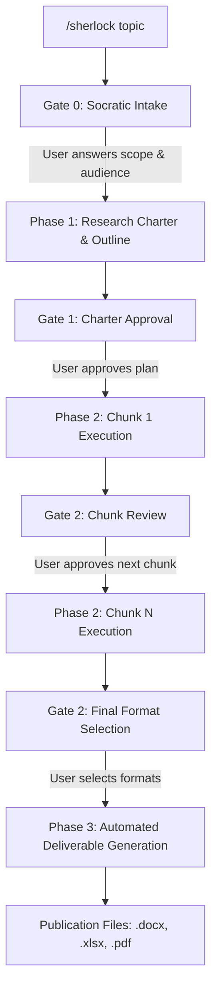

# Sherlock: Empirical Deep Research Agent

> **Zero-hallucination deep secondary research protocol for AI agents where data accuracy is the absolute #1 target.**

Sherlock is an agent skill for AI environments (Google Antigravity, Claude Code, Gemini CLI, etc.) that turns AI into an exhaustive, publication-grade research analyst. It pairs progressive multi-hop search and verbatim source scraping with 2+ source triangulation, strict 1-chunk-per-turn context preservation, and interactive human-in-the-loop approval gates.

---

## ⚡ How It Works (Zero Scripts Needed)

> **Important**: You interact with Sherlock **purely through your AI chat interface**. You do **not** need to run Python scripts or terminal commands manually. Sherlock conducts the investigation, manages state, synthesizes findings, and automatically renders publication-grade deliverables on your behalf.

### Quick Start

Simply type the slash command in your agent chat:

```bash
/sherlock <topic> [domain] [flags]
```

#### Examples:

- **Pharma & Healthcare:**
  ```bash
  /sherlock "ADC clinical trial survival rates" pharma --format all --include-datasets
  ```
- **Enterprise Technology:**
  ```bash
  /sherlock "Kubernetes vs serverless TCO in banking" tech --format docx,pdf
  ```
- **Finance & Private Equity:**
  ```bash
  /sherlock "Global enterprise SaaS EBITDA multiples 2024" finance --format all
  ```
- **General / Cross-Domain Research:**
  ```bash
  /sherlock "Renewable energy battery storage capex trends" --include-datasets
  ```

---

## 🎛️ Command Options & Flags

When invoking `/sherlock`, you can pass optional parameters to tailor the investigation upfront:

| Option / Flag | Purpose | Examples / Values |
|---------------|---------|-------------------|
| `[domain]` | Focuses research on specialized investigation frameworks and trusted whitelists | `pharma`, `tech`, `finance`, `legal`, `admin`, `ai`, `general` |
| `--format <selection>` | Specifies which deliverable files to generate at completion | `all` (default), `docx`, `xlsx`, `pdf`, `docx,pdf`, `xlsx,pdf` |
| `--include-datasets` | Pulls structured quantitative series into dedicated Excel tabs with native interactive charts | Flag present / omitted |

*(Note: Even if you do not specify flags upfront, Sherlock will interactively prompt you at Gate 0 and Gate 2).*

---

## 🚦 Human-in-the-Loop Workflow (The 4 Gates)

Sherlock is built on strict **context preservation** and **human oversight**. It never runs wild or generates unchecked volumes. Between every stage, Sherlock pauses and presents clear choices:



### Gate 0: Socratic Problem Formulation
Before doing any searches or plans, Sherlock stops to ask 5 clarifying questions:
1. **Domain Expertise Selection**: Chooses between Pharma, Tech, Finance, Legal, Admin, AI, or General.
2. **Target Audience**: Who is reading this? (e.g., C-Suite Executives, Board of Directors, Clinical Officers, Technical Architects).
3. **Core Decision at Stake**: What strategic, operational, or capital decision rides on this data?
4. **Scope Boundaries & Exclusions**: What geographies, demographics, or timeframes are in-scope vs excluded?
5. **Baseline Hypotheses**: What working numbers or hypotheses should be empirically verified or disproven?

### Gate 1: Research Charter Approval
Sherlock formalizes your answers into a binding `research_plan.txt` contract and presents a MECE chunk outline. You review and approve before any deep web crawling begins.

### Gate 2: Turn-by-Turn Chunk Review
Sherlock executes **strictly one chunk per turn** to avoid context window pollution and hallucination creep. At the end of each chunk, you see:
- Verified data points count
- Triangulation rate (% backed by 2+ sources)
- Clean bullet findings with citation references (`[DP-#]`)
- An interactive prompt asking whether to proceed to the next chunk or revise.

### Final Gate 2: Deliverable Format Selection
When all chunks are complete, Sherlock presents an interactive menu to choose your desired outputs:
- **(Recommended) All Formats (.docx, .xlsx, .pdf)**
- **Executive Word Dossier only (.docx)**
- **Analytical Data Spreadsheet only (.xlsx)**
- **Vector PDF Briefing only (.pdf)**
- **Word + PDF Dossiers (.docx, .pdf)**

Once you select your preference, Sherlock automatically runs the internal export engine and provides clickable file links in chat.

---

## 📦 The Three Deliverables

Sherlock produces up to three publication-grade deliverables tailored for leadership and executive review:

### 1. Executive Dossier (`.docx`)
Designed specifically for boardrooms, investment committees, and executive directors:
- **Bottom-Line-Up-Front (BLUF)**: Navy left-accent callout box with core strategic takeaway.
- **Executive KPI Scorecard**: 4-column summary table benchmarking key empirical findings.
- **Standalone 1-Page Memo**: Self-contained briefing section followed by a clean page break.
- **Comparative Analysis & Matrices**: Structured benchmark tables across cohorts or competitors.
- **Authoritative Conflict Adjudication Log**: Clear accounting of variances between trusted sources without artificial smoothing.
- **Verified Data Points Index**: Full audit table with Source Tier badges and exact verbatim quotes.
- **Zero Markdown Asterisks Standard**: Clean corporate typography without raw asterisks (`**`) or arbitrary number bolding.

### 2. Direct Vector PDF Briefing (`.pdf`)
A publication-ready vector PDF generated directly from the executive dossier using native Word COM vector rendering (with headless fallback):
- High-fidelity typography and layout.
- Crisp vector text, lines, and borders that remain sharp at any zoom level.
- Perfect for emailing, attaching to board packs, or printing.

### 3. Analytical Data Workbook (`.xlsx`) & CSV
An enterprise-grade financial/analytical spreadsheet:
- **Sheet 1 ("Verified Data Points")**: Full 9-column audit dataset with emerald green highlights for triangulated points and source tier badges.
- **Sheet 2 ("Executive Summary & Audit")**: Domain metadata banner, BLUF card, KPI scorecard, and Evidence Quality Audit metrics (Tier 1/2 distribution % and triangulation rate).
- **Sheet 3+ ("Comparative Matrices")**: Styled benchmark tables.
- **Sheet ("Charts & Datasets")** *(when `--include-datasets` is enabled)*: Dedicated tables of quantitative series dynamically bound to native **OpenPyXL visual charts** (Bar, Column, Line) with corporate color palettes.
- **Accompanying `.csv` files**: UTF-8 machine-readable tables for programmatic downstream workflows.

---

## 🛡️ Non-Negotiable Empirical Invariants

Sherlock was designed to overcome the fatal flaw of standard LLM research: **hallucinations and uncorroborated assertions**.

1. **Absolute Data Accuracy as #1 Target**: Zero tolerance for inaccuracies. If a number cannot be verified against retrieved text, it is rejected.
2. **Zero Parametric Memory**: Sherlock is forbidden from relying on internal model weights for factual claims. Every metric must come from live retrieved pages.
3. **3-Tier Source Authority Hierarchy**:
   - **Tier 1 (Primary / Regulatory / Peer-Reviewed)**: FDA, SEC EDGAR, ClinicalTrials.gov, PubMed, Central Banks, Census Bureau.
   - **Tier 2 (Institutional / Audited)**: World Bank, IMF, OECD, ISO, NIST, audited financial reports.
   - **Tier 3 (Secondary / Industry Media)**: TechCrunch, trade press, market blogs.
4. **2+ Independent Source Triangulation**: To earn "Highest" confidence, a claim must have a verbatim primary source quote AND be corroborated by an independent secondary search grep—with at least one Tier 1 or Tier 2 authority.
5. **Authoritative Conflict Adjudication**: When two authoritative sources conflict (e.g. FDA vs WHO), Sherlock **never averages or smooths** the figures. It logs both values, dates, and methodologies, diagnosing the root cause of variance.
6. **Clean Typography**: Eliminates markdown formatting noise—zero raw asterisks around text or metrics.

---

## 🔧 Installation & Setup

Sherlock is an agent skill packaged in accordance with standard Agent Skill conventions:

### Option 1: Global Agent Skill (Recommended)
Place the skill files into your personal AI configuration directory:
```
~/.gemini/config/skills/sherlock/
  ├── SKILL.md
  └── scripts/
      └── export_sherlock.py
```

### Option 2: Workspace Project Skill
Include Sherlock directly inside your project repository:
```
your-project/
  ├── .agents/skills/sherlock/
  │   ├── SKILL.md
  │   └── scripts/export_sherlock.py
```

### Environment Requirements
Sherlock uses standard Python libraries for generating files:
```bash
pip install openpyxl python-docx pywin32 playwright
```
*(On Windows, `pywin32` provides native Word COM vector PDF export. If running in headless or non-Windows environments, Playwright provides the cross-platform vector PDF fallback).*
